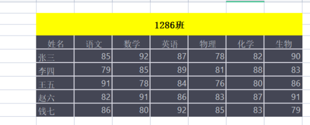
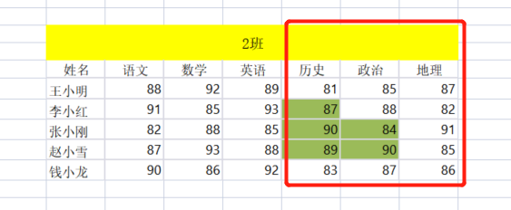
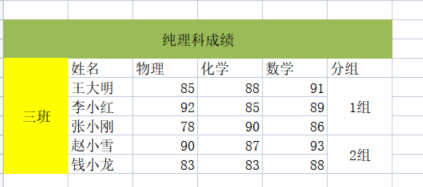
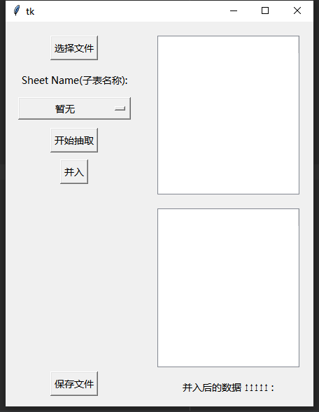
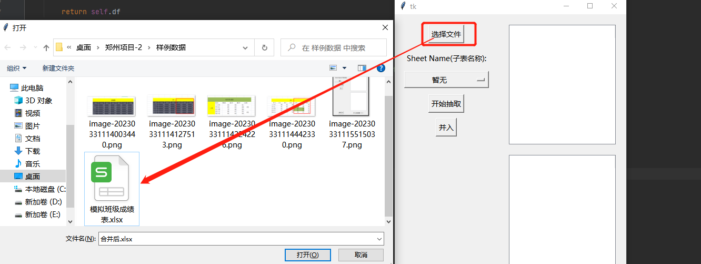
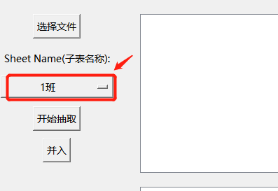
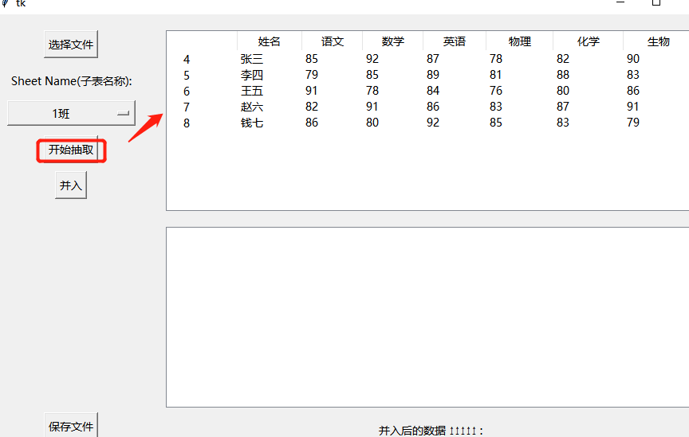
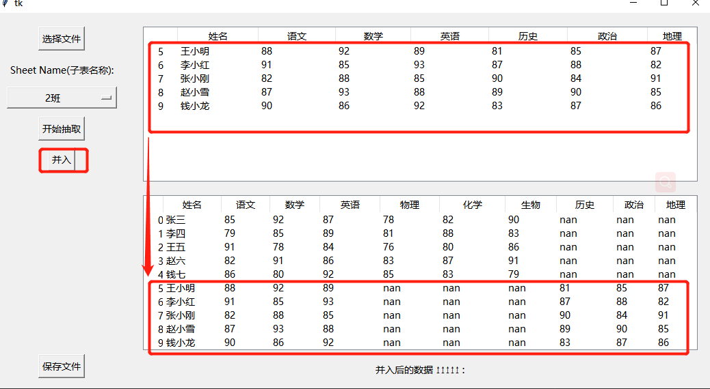

# 各种样式的表格数据自动统一抽取

## 前言

想象一下这样的场景：将收集下面部门提交上来的表进行汇总的时候，由于没有对表的格式进行规范，导致下边提交上来的表格样式各种各样。这种情况的汇总似乎只能靠人力，去一个表一个表的辨别提取再汇总在一起。

例如：教务处主任老张老师要收集某一年级学生成绩做汇总，于是他给手下的老师下发了任务，每个老师将他班级学生的成绩收集汇总一下交上来。一段时间后他收到了下边老师呈交的表文件：

一班是这样的：



二班是这样的：（二班是文科，发现了有三个学科不一样）



三班是这样的：（只有理科的成绩，并且左右有合并单元格的格式）



四班、五班、、、、、

就这样每个班的表格都有自己独特的样式。这样的表格合并任务看起来是很累人的，因为没有一个统一的表格样式，只能人为的一个表一个表的查找复制粘贴。

基于这样的场景业务背景，开发了一套可以只能抽取各种样式表格中信息，并实现一键合并的程序。用来大大方便这一类任务的处理便捷性。

## 启动

1. 首先，请确保您已经安装了Python运行环境，并且环境变量已经正确配置。pyhton>3.5

2. requestment.txt中记录了python环境所依赖的库。

3. 在使用本工具前，请确保已安装以下依赖：

   - Python 3
   - pandas
   - openpyxl
   - tkinter

4. 运行以下命令安装依赖库：

   ```
   pip install -r requestment.txt
   ```

   如果您已经安装了某些依赖库，也可以手动安装缺失的依赖库。

5. 在命令行中输入以下命令启动GUI应用程序：

   ```
   python GUI.py
   ```

6. 按下回车键，应用程序将会启动。您可以通过应用程序窗口中提供的用户界面来与程序进行交互。



## 使用

### 选择文件

在主界面中，您会看到一个 "选择文件" 按钮。点击该按钮，选择要抽取数据的Excel文件。



### 选择子表

一旦您选择了文件，下拉框中将会显示出该Excel文件中的所有子表。选择您想要抽取数据的子表。



### 抽取数据

点击 "开始抽取" 按钮，本工具将会自动抽取您选择的子表中的数据。抽取的结果会显示在右上角的文本框中。



### 合并数据

点击 "并入" 按钮，本工具将会合并之前抽取的所有数据。合并的结果会显示在右下角的文本框中。



### 保存数据

最后，点击 "保存文件" 按钮，本工具将会把合并的数据保存到您选择的位置。

### 总结

本工具提供了一个简单易用的界面，让用户能够轻松地从Excel文件中抽取并合并数据。如果您在使用本工具的过程中遇到了问题，可以参考本文档或者联系开发人员获取帮助。

## 代码概述

### GUI.py

Application类有几种方法，定义了GUI程序的功能，如clear_cache_folder、on_closing、merge_data_toexcel、get_save_path、create_widgets、get_file_path和start_processing。

clear_cache_folder方法删除./cache目录中的所有文件，然后删除目录本身。

当用户点击窗口的关闭按钮时，on_closing方法被调用。它调用clear_cache_folder方法，然后销毁主窗口，有效地关闭GUI应用程序。

merge_data_toexcel方法接受一个文件路径作为参数，并将self.merge_df中的数据（如果存在）保存到指定路径中作为Excel文件，使用pandas.ExcelWriter方法。如果在保存过程中出现错误，该方法将错误消息打印到控制台。

get_save_path方法打开一个文件对话框，允许用户选择合并数据的保存路径，然后调用merge_data_toexcel方法，以选定的路径作为参数。

create_widgets方法创建GUI程序的小部件，如按钮和标签，并使用tk.Frame.pack方法将它们打包到主窗口中。

get_file_path方法打开一个文件对话框，允许用户选择文件路径，创建一个DataProcessorExcel对象，并从该对象获取工作表名称列表，然后使用更新工作表名称下拉菜单。

start_processing方法从工作表名称下拉菜单中获取所选的工作表名称，使用所选的文件路径创建DataProcessorExcel对象，调用该对象的process方法并传入所选的工作表名称，然后使用处理后的数据更新TreeView小部件。


### data_processor.py

模块：data_processor.py

这个模块包含了DataProcessorExcel类，可以用来处理和清洗Excel文件中的数据。处理后的数据可以保存到新的Excel文件中。

DataProcessorExcel：用于处理来自Excel文件的数据的类。

 方法：

init(self, file_path)：初始化DataProcessorExcel对象。 process(self, sheet_name=None)：处理来自Excel文件的数据并返回pandas DataFrame。 save_processed_data(self, file_path)：将处理后的数据保存到新的Excel文件中。 get_sheet_name_list(self)：返回Excel文件中工作表名称的列表。 属性：

file_path：表示要处理的Excel文件的路径的字符串。 sheet_name：表示要处理的工作表的名称的字符串。如果为None，则处理第一个工作表。 df：包含处理后数据的pandas DataFrame。 header_row：表示标题行的行号的整数。 cols_to_drop：要删除的列名列表。 sheet_name_list：Excel文件中工作表名称的列表。 cache_path：表示用于处理的缓存Excel文件的路径的字符串。